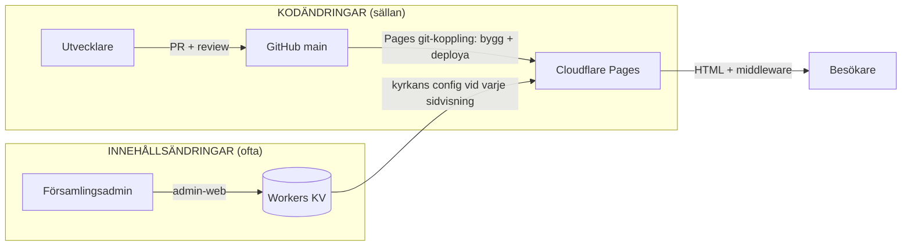
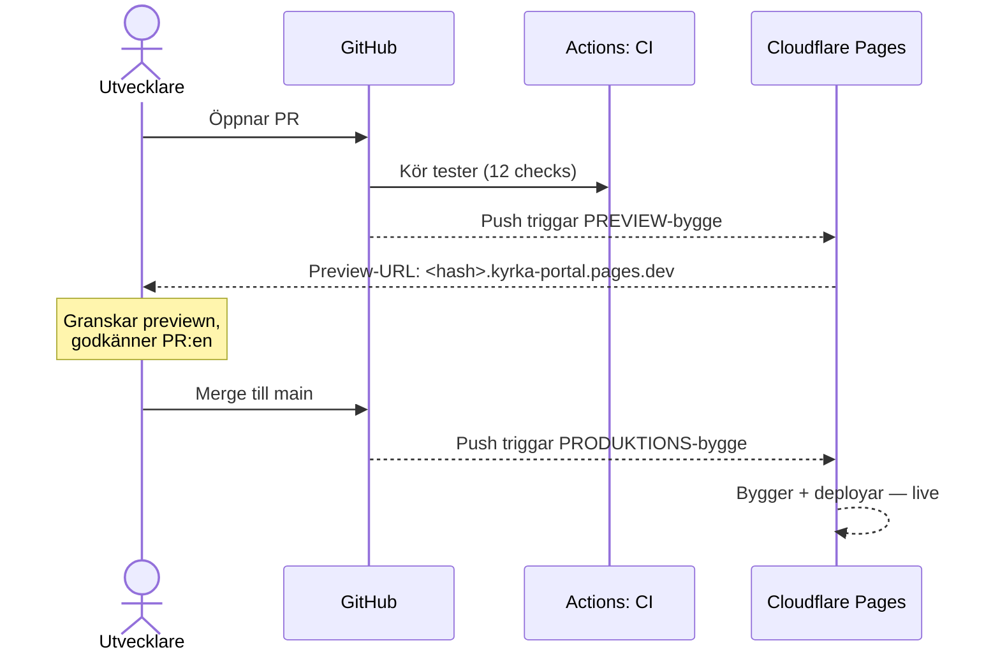
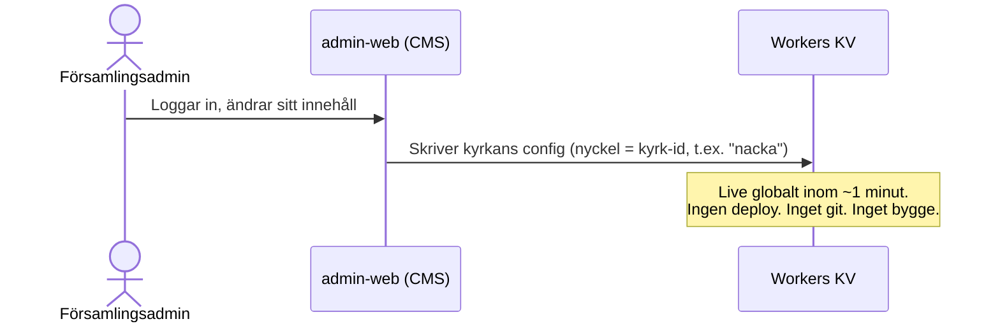
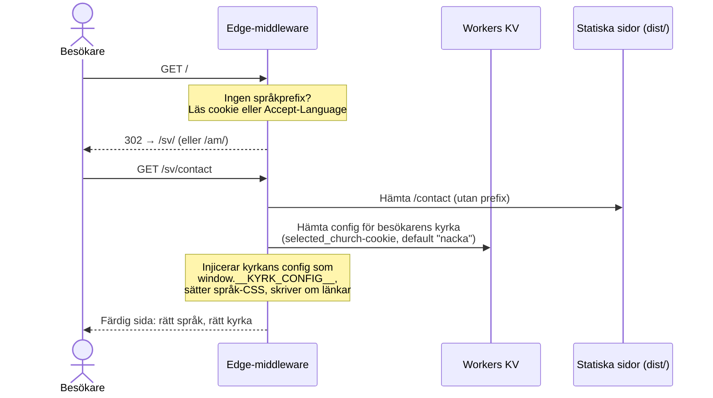

# 25 — Deploy & innehållsflöde för publika portalen

Hur den publika sajten (kyrka-portal.pages.dev) byggs, deployas och får sitt
innehåll — varför det ser ut som det gör, och exakt vad som händer i varje
flöde. Skriven så att vem som helst i teamet kan följa den, även utan
förkunskaper.

---

## Förklarat på 30 sekunder

Tänk på sajten som en restaurang:

- **GitHub är receptboken.** Alla recept (koden) finns där, och varje ändring
  av ett recept granskas innan den godkänns.
- **Cloudflare Pages är köket och serveringen.** Pages-projektet är
  git-kopplat till repot: när ett recept godkänns (merge till `main`)
  bygger Cloudflare själv maten och serverar den — snabbt, från ett ställe
  nära besökarna (edge-nätverket). Varje annan branch får automatiskt en
  provsmakning (preview-URL).
- **Workers KV är dagens-rätt-tavlan.** Varje kyrka har sin egen ruta på
  tavlan (öppettider, aktiviteter, kontaktuppgifter). Församlingsadmins
  ändrar sin ruta via admin-web — **utan att köket behöver laga något nytt**.
  Ändringen syns för besökarna inom någon minut.

Två helt separata flöden alltså: **recept** (kod, går via kök/deploy) och
**dagens rätt** (innehåll, går direkt till tavlan/KV). De möts först när
besökaren får sin tallrik.

---

## Översikt

---

## Varför det ser ut så här

### Bakgrund: incidenten 2026-06-11

Sajten serverade en gammal build som inte matchade källkoden. Felsökningen
hittade tre samverkande fel:

1. Pages-projektets git-koppling pekade på **fel GitHub-repo**
   (`Compuute/.github` i stället för `Compuute/kyrk-projekt`) — pushar till
   rätt repo triggade aldrig några byggen.
2. Byggkommandot var felstavat (`npx eleventy` i stället för
   `npx @11ty/eleventy`), så de byggen som ändå triggades failade.
3. `functions/`-katalogen låg på fel plats och deployades aldrig, så hela
   edge-funktionen (språkrouting + KV-innehåll) var vilande.

Cloudflare stödjer inte att byta repo på ett befintligt Pages-projekt
(dokumenterad begränsning). Som första åtgärd deployades sajten via
GitHub Actions (`deploy-sites`-workflowen). Senare samma dag raderades och
återskapades Pages-projektet med samma namn — vilket bevarar URL:en — och
kopplades till rätt repo. Sedan dess är **Pages git-koppling den officiella
deployvägen** (ADR-018); `deploy-sites` finns kvar som manuellt triggad
reservväg om Pages byggpipeline skulle vara nere.

### Besluten i korthet

| Beslut | Varför |
|---|---|
| Deploy via Pages git-koppling (projektet återskapat mot rätt repo) | Noll hemligheter att rotera, byggloggar och previews direkt i Cloudflare, och deployen kan aldrig divergera från `main`. `deploy-sites`-workflowen behålls som manuell reservväg |
| Innehåll i Workers KV, inte i git | 10 församlingar som uppdaterar aktiviteter och kontaktuppgifter löpande kan inte gå via PR + deploy; KV ger live-ändring inom minuten via admin-web |
| `functions/` i repo-roten | Cloudflare Pages letar efter Functions-katalogen i byggets rot — det är därför den måste ligga där och wrangler måste köras från repo-roten |
| Endast GREEN-innehåll i KV | Zonmodellen (doc 16): KV innehåller publik församlingsinfo, aldrig PII |

---

## Flöde 1: Kodändring → produktion

Gäller allt som ändrar sajtens utseende eller funktion: nya sidor, design,
`app.ts`, middleware, byggkonfiguration.

Konkret gör Pages-bygget (inställt i Cloudflare-projektet, dokumenterat i
ADR-018):

1. Klonar repot vid den pushade committen
2. `npm clean-install` — installerar byggverktygen (automatiskt)
3. Byggkommando: `make build-js && npx @11ty/eleventy` — typkollar och
   kompilerar `app.ts` → `app.js`, bygger sedan HTML-sidorna till
   `frontend/member-portal/dist/`
4. Deployar `dist/` och bundlar `functions/` (middlewaren) från repo-roten

Output-katalog: `frontend/member-portal/dist`. Root directory: tom
(repo-roten — krävs för att `functions/` ska hittas). KV-bindningen
`kyrka_content` är inställd för både production och preview.

**Var ser jag deployer?** Cloudflare-dashboarden → Workers & Pages →
kyrka-portal → **Deployments** (bygglogg per deploy). Varje commit får
också en statusrad i GitHub via Pages-integrationen.

---

## Flöde 2: Innehållsändring → live (ingen deploy!)

Gäller det församlingarna ändrar löpande: aktiviteter, gudstjänsttider,
kontaktuppgifter, taglines.

admin-web använder adaptern
[cloudflare_kv_store.py](../services/admin-web/app/adapters/cloudflare_kv_store.py)
(aktiv när `ADAPTER_MODE=production`) med en API-token som **bara** får
skriva KV. Varje kyrka är en nyckel i namespacet `kyrka_content`;
värdet är samma JSON-format som [churches/](../frontend/member-portal/churches/)
(`nacka` och `stockholm` är seedade därifrån).

> **Viktigt:** KV får bara innehålla GREEN-klassat publikt innehåll
> (zonmodellen, doc 16). Aldrig personuppgifter.

---

## Flöde 2b: Strukturell config synkas automatiskt till KV

Två källor skriver till samma KV-dokument, med **olika ägarskap**:

| Källa | Äger | Exempel |
|---|---|---|
| **admin-web content editor** | redaktionellt innehåll | namn, tagline, meddelanden, kommande händelser |
| **repot** (`churches/<id>/content.json`) | strukturella fält | `youtube_channel_id`, `youtube_handle`, `live_schedule` |

Cloudflare Pages-bygget rör **inte** KV, så strukturella fält som lades
till i repot nådde tidigare aldrig produktion utan en manuell
`wrangler kv put` — vilket dessutom riskerade att skriva över admins
redaktionella ändringar. Workflowen
[sync-content-kv.yml](../.github/workflows/sync-content-kv.yml) stänger
gapet **säkert**: vid varje push till `main` som rör en kyrkas
`content.json` kör [scripts/sync-church-kv.mjs](../scripts/sync-church-kv.mjs)
som **per kyrka** hämtar det levande KV-dokumentet, lägger på *enbart* de
strukturella fälten (allowlist) och skriver tillbaka. Allt redaktionellt
admin-web skrivit bevaras orört. Saknas KV-nyckeln (ny kyrka) seedas hela
repo-dokumentet; vid annat fel än 404 avbryts körningen så ett tillfälligt
fel aldrig kan nolla en kyrka.

> Token: `CLOUDFLARE_API_TOKEN` måste ha **Workers KV Storage: Edit**
> (Pages-only-token räcker inte). Merge-logiken verifieras av ett test
> innan KV rörs.

---

## Flöde 3: Vad händer när en besökare öppnar sajten

Det är här de två flödena möts. Edge-middlewaren
([functions/_middleware.ts](../functions/_middleware.ts)) kör vid varje
sidvisning, på Cloudflares servrar nära besökaren:

Tre saker sker alltså vid varje sidvisning:

1. **Språkrouting** — `/` skickar till `/sv/` eller `/am/` utifrån
   besökarens cookie eller webbläsarspråk. Sidan serveras med rätt språk
   synligt direkt (ingen blinkning).
2. **Kyrkval** — `selected_church`-cookien avgör vilken kyrkas config som
   hämtas från KV och injiceras i sidan. Byter besökaren kyrka i
   kyrkväljaren sätts cookien om och nästa sidladdning visar den kyrkan.
3. **Fallback** — om KV inte svarar använder sidan den statiska
   `content.json` som ingår i bygget, så sajten fungerar även då.

---

## Om något går fel

| Symptom | Titta här | Åtgärd |
|---|---|---|
| Bygget failade | Cloudflare → kyrka-portal → Deployments → bygglogg | Fixa, merga igen — eller "Retry deployment" i dashboarden |
| Fel innehåll på sajten efter deploy | Cloudflare → kyrka-portal → Deployments | `wrangler pages deployment rollback --project-name=kyrka-portal` (omedelbar) |
| Felaktig kodändring i produktion | GitHub | `git revert` av merge-committen → ny PR → merge (deployar automatiskt) |
| En kyrkas innehåll är fel | KV via admin-web | Rätta i admin-web; akut: `wrangler kv key put <kyrk-id> --path <fil> --namespace-id=<id> --remote` |
| Manuell deploy behövs (Pages-byggen nere) | GitHub → Actions → deploy-sites → Run workflow | Eller från **repo-roten**: `make build-js && npx @11ty/eleventy && npx wrangler pages deploy frontend/member-portal/dist --project-name=kyrka-portal --branch=main` |

---

## Onboarda en ny kyrka

Tre steg per kyrka — inget av dem kräver mer än några minuter:

1. **Lägg till kyrkan i [churches.json](../frontend/member-portal/churches.json)**
   (id, namn, ort, koordinater) och skapa
   `churches/<id>/content.json` med kyrkans innehåll → PR → merge
   (deployar automatiskt). Detta gör kyrkan valbar i kyrkväljaren och
   ger den statisk fallback.
2. **KV seedas automatiskt** vid merge av PR:en i steg 1 — workflowen
   `sync-content-kv.yml` ser att kyrkans KV-nyckel saknas och skriver hela
   repo-dokumentet. (Akut/manuellt fallback:
   `npx wrangler kv key put <id> --path frontend/member-portal/churches/<id>/content.json --namespace-id=f40a72c8fa544cf6ba3ab9daeb8bb8fc --remote`)
3. **Ge kyrkans admin behörighet i admin-web** — därefter sköter de sitt
   innehåll själva via flöde 2.

---

## Hemligheter och åtkomster

| Vad | Var | Scope | Används av |
|---|---|---|---|
| `CLOUDFLARE_API_TOKEN` (GitHub-secret) | GitHub repo-secrets | Cloudflare Pages: Edit — inget annat | deploy-sites (manuell reservväg) |
| KV-token för admin-web | GCP Secret Manager | Workers KV Storage: Edit — inget annat | `cloudflare_kv_store.py` |
| KV-namespace `kyrka_content` | Cloudflare-kontot | id `f40a72c8fa544cf6ba3ab9daeb8bb8fc`, bundet till kyrka-portal (production + preview) | middleware + admin-web |

Principen är least privilege: varje token gör exakt en sak. Tokens roteras
omedelbart om de exponeras (skapa ny → uppdatera secret → revoka gammal).

> **Obs:** Pages-projektets git-koppling går till `Compuute/kyrk-projekt`
> med produktionsbranch `main` — det är hela deploymekanismen, rör den
> inte. Deploya aldrig manuellt vid sidan av (varken wrangler eller
> "Create deployment"-knappen) annat än via reservvägen ovan när
> Pages-byggena är nere. En sanning: `main`.
