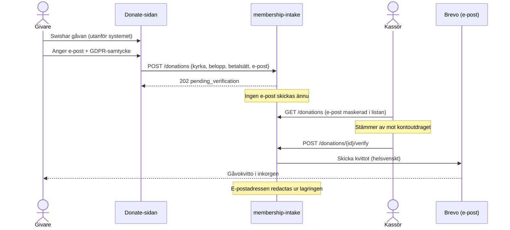

# 26 — Gåvokvittoflödet

Hur gåvokvitton via e-post fungerar: varför kvittot kräver kassörens
verifiering, vad som är automatiskt per kyrka och vad som kräver ett beslut,
samt de juridiska förutsättningarna mot Skatteverket.

Systemdesignen i kod: `services/membership-intake/` (routes_donations,
donation_service, brevo_email_sender). Deploy- och innehållsflödet i stort:
[doc 25](25-deploy-och-innehallsflode.md).

---

## Förklarat på 30 sekunder

En givare swishar en gåva och anger sin e-post på donate-sidan. Sajten kan
**inte se själva Swish-betalningen** (knappen öppnar bara Swish-appen), så
inget kvitto skickas direkt — annars hade vem som helst kunnat skaffa kvitton
utan att betala. I stället hamnar registreringen i kassörens väntelista.
När kassören stämt av gåvan mot kontoutdraget och klickar *verifiera* mejlas
kvittot. **Varje kvitto som existerar motsvarar alltså en verifierad gåva** —
exakt det underlag som behövs när kontrolluppgifter ska lämnas.

---

## Flödet

Avfärdar kassören registreringen (`/dismiss`) skickas ingenting och adressen
redactas direkt.

## Kvittot

Helsvenskt (det är ett underlag mot Skatteverket), skickas från Brevo
(EU-leverantör, utbytbar adapter) och innehåller:

| Fält | Exempel |
|---|---|
| Kvittonummer | `GK-2026-3F8A21C4` (spårbart till donationsposten) |
| Belopp | 200 kr |
| Betalsätt | Swish / Bankgiro |
| Gåvodatum | registreringsdatumet |
| Bekräftad av församlingen | verifieringsdatumet |
| Mottagare + org.nr | ur utfärdar-registret, aldrig från klienten |

Plus texten att kyrkan är godkänd gåvomottagare och att skattereduktion
kräver personnummer för kontrolluppgift (se Juridik nedan).

## Vad är automatiskt per kyrka — och vad är det inte

Tre lager, för 10 kyrkor:

| Lager | Per kyrka | Hur |
|---|---|---|
| **Betalningen** (Swish-/bankgironummer på donate-sidan) | Automatiskt | Kyrkan uppdaterar sin config i admin-web → KV → sidan visar rätt nummer direkt. Ingen deploy. |
| **Kassörsflödet** (lista/verifiera/avfärda) | Automatiskt | Endpoints är kyrk-scopade via inloggningen — varje kassör ser bara sin kyrkas gåvor. |
| **Kvittoutfärdandet** | **En granskad rad per kyrka** | Kyrkan måste finnas i utfärdar-registret (`app/domain/churches.py`: namn + org.nr). PR → merge → auto-deploy. |

Att utfärdar-registret är kod och inte KV-innehåll är ett **medvetet
säkerhetsval**: kvittot bär juridisk identitet på ett skatteunderlag. Låg
org.nr i samma kanal som innehåll kunde vem som helst med
innehållsbehörighet utfärda kvitton under fel eller påhittad juridisk
identitet. Juridisk identitet hör hemma i git — granskad PR, spårbar
historik.

## Juridik (verifierat mot Skatteverkets regler 2026-06)

Skattereduktion för gåvor kräver:

- Mottagaren är **godkänd gåvomottagare** hos Skatteverket
- Minst **200 kr per gåva**, minst **2 000 kr per år** och givare
- Givaren lämnar **personnummer**; mottagaren lämnar **kontrolluppgift**
  till Skatteverket för varje gåva ≥ 200 kr
- Reduktionen är 25 %, max 3 000 kr/år (gåvor upp till 12 000 kr)

Konsekvenser för oss:

1. **E-postkvittot ger inte skattereduktion i sig** — det är en verifierad
   gåvobekräftelse. Kvittotexten säger detta uttryckligen.
2. **Godkännandet gäller per juridisk person.** Är kyrkorna egna org.nr
   behöver var och en sitt eget godkännande. En kyrka utan godkännande får
   inte kvittotext som påstår godkännande — innan icke-godkända kyrkor
   onboardas ska utfärdar-registret få en flagga som styr formuleringen
   (planerad, ej byggd).
3. **Fullt skattereduktionsflöde** (samla personnummer + årlig
   kontrolluppgift, "flöde B") är inte byggt. Personnummer är RED-zon-PII
   och ska hanteras som medlemsdata när det byggs. Dagens datamodell är
   förberedd: verifierade gåvor med kvittonummer är exakt det underlag
   kontrolluppgifterna behöver.

## PII-hantering

- Givarens e-post är RED-zon: maskeras i kassörens lista
  (`g***@example.se`), loggas aldrig, skickas ingenstans utom till
  e-postleverantören.
- Adressen **redactas ur lagringen** så fort posten lämnar väntelistan
  (verifierad eller avfärdad) — samma dataminimering som intake-flödet.
- GDPR-samtycke krävs i formuläret och valideras i API:t.

## Onboarda en kyrka till kvittoflödet

Utöver portal-onboardingen i [doc 25](25-deploy-och-innehallsflode.md):

1. Kyrkan uppdaterar Swish-/bankgironummer i sin config (admin-web) — klart
   direkt.
2. Bekräfta kyrkans org.nr och status som godkänd gåvomottagare hos
   Skatteverket.
3. Lägg till raden i `services/membership-intake/app/domain/churches.py`
   via PR. Merge → backend-deploy → kyrkan kan utfärda kvitton.
4. Ge kyrkans kassör admin-roll (Zitadel) så väntelistan syns.

## Drift

- **Secrets** (GitHub, används av backend-deployen): `BREVO_API_KEY`,
  `RECEIPT_FROM_EMAIL` (verifierad avsändare i Brevo). DKIM/SPF-poster för
  avsändardomänen läggs i Cloudflare DNS.
- **Misslyckad leverans:** gåvan ligger kvar som väntande och kassören
  försöker igen — status flippas aldrig utan levererat kvitto.
- **Kostnad:** Brevos gratisnivå (300 mejl/dag) räcker med stor marginal
  för 10 församlingars kvittovolym.
- **Test:** 18 API-tester + 4 sidtester körs i varje PR. Manuellt
  end-to-end-test: registrera en gåva med egen e-post → verifiera som
  kassör → kontrollera kvittot i inkorgen.

## Uppföljningar (medvetet inte byggda än)

- Kassörs-UI i admin-web (lista + verifiera-knapp) — endpoints är klara,
  gränssnitt saknas.
- Godkännande-flagga per kyrka i utfärdar-registret (krävs före onboarding
  av icke-godkända kyrkor).
- Flöde B: personnummerinsamling + kontrolluppgifter (KU65) till
  Skatteverket.
